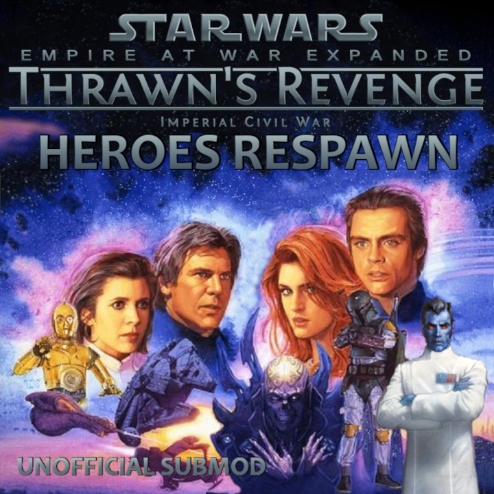

**Disclaimer**: This project is not affiliated with the EaWX team.

# TR Heroes Respawn

For those who love heroes!

### About

- Depending on the strength of the hero, most heroes will respawn in around **7 to 30 cycles** when "killed" (including AI).
- This can be toggled on and off at any time through buttons in the *Advanced Options* tab (Human and AI can be toggled separately).
- Subsequent deaths by the same hero will increase their respawn time by **10%** each time.
- Any special respawns remain unchanged.

### Exceptions to respawn

- Super Star Destroyer (SSD) heroes are excluded.
- If a warlord faction gets integrated, their heroes not alive at that moment are gone.
- Some heroes do not respawn when progressing through imperial regimes (this can be toggled in the Advanced Options tab).

### Recruitable heroes

- Imperial players may recruit multiple bounty hunters instead of only one.
- New Republic recruitable commanders follow the same respawn rules.
  When one of these heroes is defeated, their slot is effectively suspended until they respawn.
- Extra New Republic slots can be purchased for **200 credits** as many times as you want (use the blue rebel button).

### One Planet Start

Heroes spawn at the beginning of FTGU single-planet start games, matching the selected era.

# License

All **original code** authored in this project is available under the [MIT License](LICENSE).

This repository depends on files derived from **EaWX mods**.
See [ASSETS.md](ASSETS.md) for details on third-party content and asset usage.

### Workshop Content

The `mod/` directory contains the files uploaded to the Steam Workshop.

# Credits

Thanks to the EaWX team for creating and maintaining the EaWX mods.
